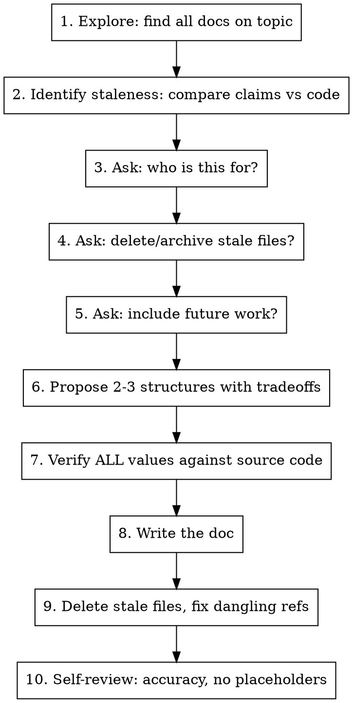

# Documentation Maintenance

Audit and refactor documentation against current code state. Produces accurate, maintainable docs that don't go stale.

## Process

## Rules

**Ask before assuming:**
- Who is the audience? (Future AI sessions, human developers, both)
- What happens to stale files? (Delete, archive, leave)
- Include future work? (Default: no — future-work sections are the #1 cause of doc staleness)

**Propose alternatives:**
- Always present 2-3 structural approaches with tradeoffs before writing
- Lead with your recommendation and why

**Verify before writing:**
- Every constant, threshold, formula, and behavioral claim must be checked against current source code
- Dispatch an Explore agent or manually grep/read to confirm values
- Document what you verified and any corrections found

**No future work unless explicitly requested:**
- Future-work sections go stale fastest — they describe intent that may never ship
- If the user wants one, keep it minimal (bullet list) and warn about maintenance cost

**Clean up completely:**
- Delete or archive stale files (per user preference)
- Search for dangling references to deleted files in other docs
- Update or remove any links pointing to deleted content

**Prevent re-staleness:**
- Doc describes current state only — no TODOs, no "planned" items
- Constants with specific values should note which source file they come from
- Add a brief maintenance note: "when code changes, update the relevant section"

## Common Mistakes

| Mistake | Fix |
|---------|-----|
| Writing docs without reading current code first | Always establish ground truth from source before writing |
| Including future-work that goes stale | Default to no future work; current state only |
| Proposing one structure without alternatives | Always offer 2-3 approaches with tradeoffs |
| Trusting old docs as source of truth | Old docs are claims — verify everything against code |
| Leaving stale files alongside new ones | Delete or archive per user preference, fix dangling refs |
| Skipping audience question | Audience determines tone, detail level, and structure |
