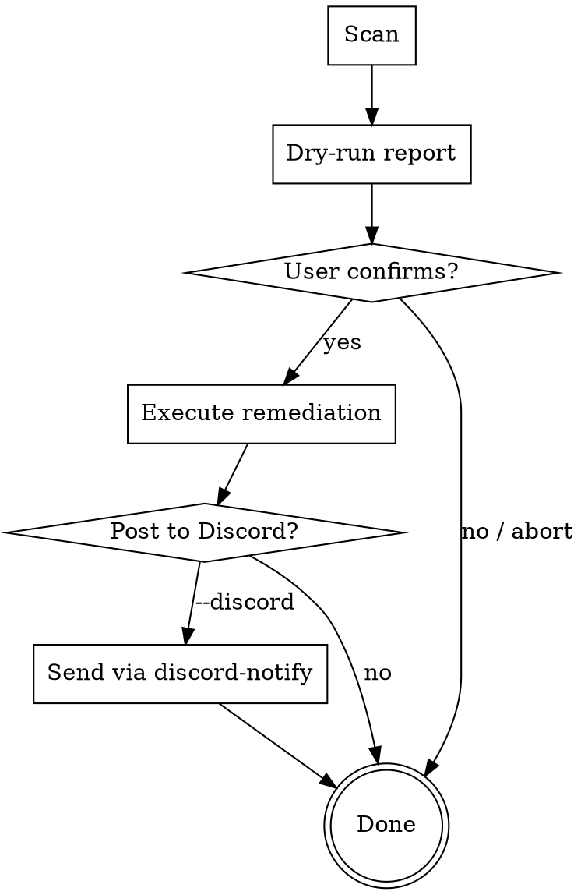

> **Convention:** Follow the ref system in `.claude/skills/_conventions/ref-system.md`.

# Ops Triage

On-demand triage for issues surfaced by admin dashboard notifications. **Always dry-run first, report findings, wait for explicit confirmation before acting.**

## Invocation

- `/ops-triage` — scan all three modes, print each mode's report sequentially under a combined header, then ask once for confirmation
- `/ops-triage cleanup` — stale lobbies, stuck matches, orphaned queue entries
- `/ops-triage bugs` — recent bug spike investigation
- `/ops-triage ci` — failed CI runs and flaky tests
- Append `--discord` to any command to post results to Discord after completion

## Workflow (All Modes)



**HARD RULE:** Never skip the dry-run report. Never execute remediation without explicit user confirmation via AskUserQuestion.

## Mode: cleanup

### Step 1 — Scan RTDB

Check admin dashboard health first:
```bash
curl -s http://localhost:5175/__admin_exec/status
```
If admin is down, fall back to reading Firebase directly via the Cloud Functions health check.

Gather current state:
- **Lobbies:** Read `lobbies/` — count by status (waiting, starting, active, playing, returning). Flag stale: host offline >2min, age >2h, missing host (corrupted).
- **Matches:** Read `matches/` — flag stuck (no `finalResult` and >10min old), expired (>24h old).
- **Queue:** Read `queuePresence/` — flag entries >5min old.
- **Firestore:** Check `onlineMatches` for docs >7 days old (if accessible).

### Step 2 — Dry-Run Report

Format findings as a table:

```
── OPS TRIAGE: CLEANUP ────────────────────
Lobbies     12 total
  ├ Stale (host offline >2m)    3  ← would prune
  ├ Stuck (>2h old)             1  ← would prune
  ├ Corrupted (no host)         0
  └ Healthy                     8
Matches     5 total
  ├ Stuck (no result, >10m)     2  ← would prune
  ├ Expired (>24h)              0
  └ Active                      3
Queue       2 entries
  └ Stale (>5m)                 1  ← would prune
───────────────────────────────────────────
Total actions: 6 items would be pruned
```

**Use AskUserQuestion** to present: "Proceed with cleanup?" with options for each category (lobbies, matches, queue) or all.

### Step 3 — Execute

Call existing Cloud Functions based on user selection:

| Target | Function | Filter |
|--------|----------|--------|
| Stale lobbies | `purgeLobbies` | `filter: 'stale'` |
| All lobbies | `purgeLobbies` | `filter: 'all'` |
| Stuck/expired matches | `purgeMatches` | — |
| Queue entries | Direct RTDB delete | `queuePresence/{uid}` |

These are callable via `httpsCallable` from the admin dashboard or via `curl` to the Cloud Functions endpoint.

Report results: `Pruned X lobbies, Y matches, Z queue entries.`

## Mode: bugs

### Step 1 — Scan Recent Reports

Read `debugReports/` from RTDB (via admin API or directly). Focus on the last 1 hour.

### Step 2 — Dry-Run Report

Group by error message and game mode:

```
── OPS TRIAGE: BUG SPIKE ──────────────────
Reports (last 1h): 7
  ├ "Cannot read property 'position' of null"  ×4  (casual, ranked)
  ├ "[E2E] Lobby join timeout"                 ×2  (e2e)
  └ "WebSocket disconnected unexpectedly"      ×1  (casual)

Top error: position null — 4 reports across 2 modes
Stack: src/game/vehicle.ts:142 → src/game/arena.ts:88
───────────────────────────────────────────
```

**Use AskUserQuestion:** "Investigate the top error in source code?" with options per error group.

### Step 3 — Execute

For each confirmed error:
1. Read the source files referenced in the stack trace
2. Identify root cause
3. Propose a fix (code diff) — do NOT apply without confirmation
4. Optionally purge debug reports after investigation: `purgeDebugReports`

## Mode: ci

### Step 1 — Scan CI Status

```bash
# Check GitHub Actions (requires gh CLI or API token)
gh run list --limit 5 --json status,conclusion,name,headBranch,createdAt 2>/dev/null
```

If `gh` is unavailable, check admin dashboard CI section:
```bash
curl -s http://localhost:5175/__admin_exec/script?name=ci-status -X POST 2>/dev/null
```

Also read the E2E matrix for failing/flaky tests:
```bash
curl -s http://localhost:5175/__admin_e2e_matrix 2>/dev/null
```

### Step 2 — Dry-Run Report

```
── OPS TRIAGE: CI / TESTS ─────────────────
GitHub Actions (last 5 runs):
  ├ CI #142  develop  ✗ FAIL  (unit-tests: 2 failures)
  ├ CI #141  develop  ✓ pass
  └ CI #140  develop  ✓ pass

E2E Matrix:
  ├ Failing: L1 (lobby join), EM2 (disconnect recovery)
  ├ Flaky:   SK1 (critical path — 3 pass / 1 fail recent)
  └ Passing: 18/21 tests
───────────────────────────────────────────
```

**Use AskUserQuestion:** "Investigate failures?" with options per failing item.

### Step 3 — Execute

For each confirmed failure:
1. Read the test file and source under test
2. Check recent git changes to those files: `git log --oneline -5 -- <file>`
3. Identify root cause
4. Propose fix — do NOT apply without confirmation
5. Update E2E matrix status if test state changed:
```bash
curl -X PATCH http://localhost:5175/__admin_e2e_matrix \
  -H 'Content-Type: application/json' \
  -d '{"id":"L1","status":"failing","lastRun":"<now>","lastResult":"fail"}'
```

## Discord Output

When `--discord` is passed (or user confirms sending after the report), post via:

```bash
node scripts/discord-notify.js report "Ops Triage" "$(cat <<'EOF'
<paste the formatted report here>
EOF
)"
```

Add `Ops Triage` to the color map in `discord-notify.js` if not present (use `0xE74C3C` red for triage alerts).

## Admin CC Panel

This skill can be dispatched from the admin dashboard CC panel via the `ops-triage` template. The template sends `/ops-triage` as the prompt to Claude Code.

When running via CC panel dispatch:
- Output is streamed to the admin dashboard
- Use AskUserQuestion for confirmations (agent will pause and wait)
- Final report is displayed in the session output

## Error Handling

- **Admin dashboard down:** Skip dashboard API calls, note "admin offline" in report, fall back to direct Firebase reads or `gh` CLI where possible.
- **`gh` CLI unavailable:** Skip CI run checks, note "gh not installed — check GitHub web UI" in report. E2E matrix is still available via admin API.
- **Cloud Function call fails:** Report the error in the results section. Do NOT retry automatically — let the user decide.
- **RTDB unreachable:** Report "Firebase unreachable" and abort that mode's scan. Other modes can still proceed.

## Key Files

| File | Purpose |
|------|---------|
| `functions/src/index.ts` | Cloud Functions: purgeLobbies, purgeMatches, purgeDebugReports, cleanupStaleLobbies, monitorHealth |
| `functions/src/discord.ts` | Discord DM alerts (outbound) |
| `admin/src/sections/purge.ts` | Admin purge UI + callable function bindings |
| `admin/src/sections/bugs.ts` | Bug report display + investigation dispatch |
| `admin/src/sections/ci.ts` | CI/GitHub Actions monitoring |
| `admin/src/sections/e2eMatrix.ts` | E2E test matrix with status tracking |
| `admin/src/ui/agentTemplates.ts` | CC panel dispatch templates |
| `scripts/discord-notify.js` | Webhook notification utility (commit, release, report) |
| `admin/data/alerts.json` | Discord webhook URLs (gitignored) |
| `database.rules.json` | RTDB structure reference |
