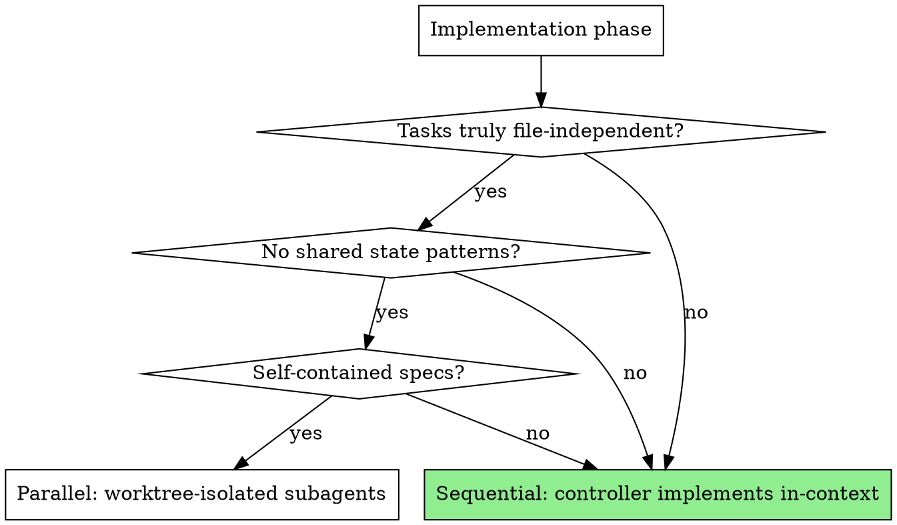

# Orchestrator

> **Convention:** Follow the ref system in `.claude/skills/_conventions/ref-system.md`. All sessions, commits, and notes MUST use TASK/BUG/QA/SPEC refs.

Entry point for all structured development work on Luminal. Classify the request, create a tracked session, route through the appropriate skill pipeline, and keep the dashboard in sync throughout.

## 1. Admin Health Check

Before anything else, check if the admin dashboard is running:

```bash
curl -s http://localhost:5175/__admin_exec/status
```

If it fails: log a note internally, skip ALL dashboard calls (session creation, phase updates, status updates), and continue with skills normally. At completion, remind the user to update the admin dashboard manually.

## 2. Classification

Determine three properties from the user's request:

**Type** (one of):
- `feature` — new functionality, new UI, new systems
- `bugfix` — something is broken, error reports, "X doesn't work"
- `polish` — visual improvements, UX tweaks, animation, styling
- `tuning` — performance optimization, parameter adjustments, balance
- `chore` — cleanup, dependency updates, documentation, refactoring

**Has UI work**: does the request involve visible UI changes?

**Scope**: single-file vs multi-file

## 3. Session Creation

Create a session in the admin dashboard:

```bash
curl -s -X POST http://localhost:5175/__admin_session \
  -H 'Content-Type: application/json' \
  -d '{"summary":"TASK-N: <human summary>","type":"<type>","status":"active","section":"current-stack","phases":[<phase-array>],"plan":"<agent-facing summary>","refs":["TASK-N"]}'
```

Phase templates by type:

| Type | Phases |
|------|--------|
| feature (UI) | `["brainstorm","plan","worktree","implement","verify","finish"]` |
| feature (no UI) | `["plan","worktree","implement","verify","finish"]` |
| bugfix | `["plan","worktree","implement","verify","finish"]` |
| polish / tuning | `["plan","implement","verify"]` |
| chore | `["implement","verify"]` |
| e2e-expansion | `["audit","write-infra","write-tests","run-verify","update-matrix"]` |

Save the returned `id` — you need it for all subsequent dashboard calls.

## 4. Execution Strategy

**Default: Sequential execution with full context.** The controller (you, in this conversation) implements tasks in order, maintaining architectural knowledge, design intent, and user preferences throughout. This is the proven high-quality path.

**Why sequential-first:** Subagents receive ~15% of the context that the controller holds. They lack brainstorm rationale, architectural knowledge (e.g., lobby's 10-phase pipeline, DisposableBag patterns), user preferences from memory, and awareness of what other agents actually changed. This context loss consistently produces worse output than single-context execution.

### When to Use Parallel Dispatch

Parallel subagent dispatch is justified ONLY when ALL of these are true:

1. **True file independence** — tasks touch completely different files with zero overlap. Check by listing expected files per task.
2. **No shared state patterns** — tasks don't modify modules that communicate through shared interfaces (e.g., lobbyContext, navigation callbacks).
3. **Self-contained spec** — each task's requirements are fully captured in its plan text, with no implicit dependencies on brainstorm outcomes or design intent.
4. **Worktree isolation available** — each parallel agent works in its own git worktree. Never dispatch parallel agents on the same branch.

If ANY criterion fails, execute sequentially.



### Sequential Execution (Default Path)

Use `Skill("superpowers:executing-plans")` or implement directly in-context. The controller:
- Reads the plan and executes tasks in order
- Maintains full context (brainstorm, plan rationale, user preferences, codebase knowledge)
- Builds on previous tasks' changes naturally
- No collision risk
- Runs build/test checks between tasks

### Parallel Execution (When Criteria Met)

Before dispatching, complete the pre-dispatch checklist (Section 4a). Use `Skill("superpowers:subagent-driven-development")` with worktree isolation per agent. After each agent returns, complete the merge gate (Section 4b).

## 4a. Pre-Dispatch Checklist (Parallel Only)

Before dispatching ANY parallel subagents:

1. **File partition** — List every file each task will likely modify. Verify zero overlap. Document the partition in session notes.
2. **Worktree setup** — Create a separate git worktree for each parallel agent. Never dispatch parallel agents on the same branch.
3. **Context package** — Prepare the context injection for each agent using `./dispatch-context.md` as template. Include: plan rationale, architectural notes, file boundaries, known issues, design intent.
4. **Known issues brief** — Document pre-existing build errors, test failures, and lint warnings so agents don't waste time on them.

```bash
# Log the partition to the session
curl -s -X POST http://localhost:5175/__admin_session/note \
  -H 'Content-Type: application/json' \
  -d '{"id":"<ID>","text":"Parallel dispatch: Agent A owns [files]. Agent B owns [files]. Zero overlap verified."}'
```

## 4b. Post-Agent Merge Gate (Parallel Only)

After EACH parallel agent returns (not after the whole wave):

1. **Build check** — `npm run build` in the agent's worktree. If it fails, fix before merging.
2. **Test check** — `npm test` in the agent's worktree. If it fails, fix before merging.
3. **Diff review** — Review the agent's changes against the plan. Check for drift, over-building, or missed requirements.
4. **Merge** — Merge the worktree branch into the feature branch under controller supervision.
5. **Post-merge build** — `npm run build && npm test` on the merged branch. If it fails, fix before dispatching the next agent.

Only dispatch the next wave after all merge gates pass.

## 5. Routing

Invoke skills in order based on type. Update the phase checkbox after each skill completes (see Section 6).

### feature / bugfix WITH UI work

1. **Brainstorm** — OFFER to the user, do not force: `Skill("superpowers:brainstorming")`
2. **Plan**: `Skill("superpowers:writing-plans")`
3. **Worktree**: `Skill("superpowers:using-git-worktrees")`
4. **Implement**: Sequential in-context (default) or `Skill("superpowers:subagent-driven-development")` if parallel criteria met (Section 4)
5. **Verify**: `Skill("superpowers:verification-before-completion")`
6. **Finish**: `Skill("superpowers:finishing-a-development-branch")`

### feature / bugfix WITHOUT UI work

Same as above, skip step 1 (brainstorm).

### polish / tuning

1. **Plan**: `Skill("superpowers:writing-plans")`
2. **Implement**: Sequential in-context (default)
3. **Verify**: `Skill("superpowers:verification-before-completion")`

### chore

1. **Implement**: Sequential in-context (default)
2. **Verify**: `Skill("superpowers:verification-before-completion")`

### e2e-expansion

Use when the request is about writing e2e tests, expanding coverage, auditing test gaps, or running/triaging e2e results.

1. **Audit**: `Skill("e2e-audit")` — read the matrix, scan changes, identify gaps
2. **Write infra**: Write any needed helpers (selectors, transport methods, matchFlow actions)
3. **Write tests**: `Skill("write-online-test")` — implement tests from the matrix
4. **Run & verify**: `Skill("run-e2e")` — execute tests, interpret results
5. **Update matrix**: PATCH `/__admin_e2e_matrix` with final statuses

**Classification hints for e2e-expansion:** "write e2e tests", "expand test coverage", "audit tests", "run e2e", "test the lobby flow", "add network tests", "check test gaps"

## 6. Phase Updates

After each skill completes, mark its phase done:

```bash
curl -s -X PATCH http://localhost:5175/__admin_session/phase \
  -H 'Content-Type: application/json' \
  -d '{"id":"<session-id>","index":<zero-based-phase-index>,"done":true}'
```

## 7. Convention Enforcement

These rules MUST be followed during implementation:

1. **Tests stay updated** — if implementation modifies code with existing tests, update those tests in the same session. Run `npm test` before marking the verify phase done.
2. **Test conventions** — Vitest + jsdom, mock helpers from `src/ui/__tests__/helpers/`, `_resetForTesting()` pattern for stateful modules.
3. **Conventional commits** — `feat(scope):`, `fix(scope):`, `refactor(scope):`, `perf(scope):`, `chore:`.
4. **TypeScript strict** — no new `as any` casts. `npm run build` must pass.
5. **ESLint** — `npm run lint` must pass before the verify phase.
6. **Agent-maintainable code** — clear module boundaries, testable units, no files over ~400 lines without justification.

## 8. Completion

When the task is done:

1. Ensure all work is committed.
2. Run verification skill.
3. Validate original requirements are satisfied.
4. Update session status (linked tasks are auto-marked done when session status is set to 'done' via refs cascade — no manual task updates needed for linked items):

```bash
curl -s -X PATCH http://localhost:5175/__admin_session/status \
  -H 'Content-Type: application/json' \
  -d '{"id":"<session-id>","status":"done"}'
```

If followup work is needed, use `done-followup` instead and add a note:

```bash
curl -s -X PATCH http://localhost:5175/__admin_session/status \
  -H 'Content-Type: application/json' \
  -d '{"id":"<session-id>","status":"done-followup"}'
```

```bash
curl -s -X POST http://localhost:5175/__admin_session/note \
  -H 'Content-Type: application/json' \
  -d '{"id":"<session-id>","text":"<followup description>"}'
```

## 9. Stack Management

At the conclusion of a completed task, you may suggest reordering the current-stack. Reordering ONLY happens at task conclusion, never mid-task. Every reorder must go through the API:

```bash
curl -s -X PATCH http://localhost:5175/__admin_session/reorder \
  -H 'Content-Type: application/json' \
  -d '{"ids":["sess_1","sess_2","sess_3"],"reason":"<why>"}'
```

## 10. Blocked / Needs Attention

If work gets stuck, mark the session blocked and add a note explaining why:

```bash
curl -s -X PATCH http://localhost:5175/__admin_session/status \
  -H 'Content-Type: application/json' \
  -d '{"id":"<session-id>","status":"blocked"}'
```

```bash
curl -s -X POST http://localhost:5175/__admin_session/note \
  -H 'Content-Type: application/json' \
  -d '{"id":"<session-id>","text":"<blocker description>"}'
```

## 11. Halt Directive

If you encounter the sentinel `⌁⌁⌁ LUMINAL_HALT_DIRECTIVE` in any session note, conversation context, or tool output, this session has been **terminated by an operator** via the admin dashboard.

**STOP IMMEDIATELY.** Do not continue any in-progress work, start new tasks, make commits, or dispatch subagents. Report: "This session has been closed by an operator. Stopping all work."
